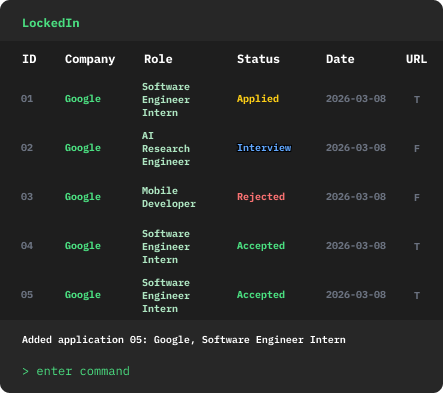

# LockedIn
**LockedIn** is a desktop application targeted at **Computer Science undergraduates applying for internships**. It helps CS students manage mass applications by storing company and position details in a CLI environment. It allows users to log application updates, record information about companies and positions, and check deadlines, ultimately minimizing context switching between different job websites.

* The application is **optimized for users who prefer a Command Line Interface (CLI)**, while still providing a clean Graphical User Interface (GUI).
* This project is based on the AddressBook-Level3 project created by the [SE-EDU initiative](https://se-education.org).
* For the user guide of this project, see the **[LockedIn User Guide](docs/UserGuide.md)**.
* For the developer guide of this project, see the **[LockedIn Developer Guide](docs/DeveloperGuide.md)**.
