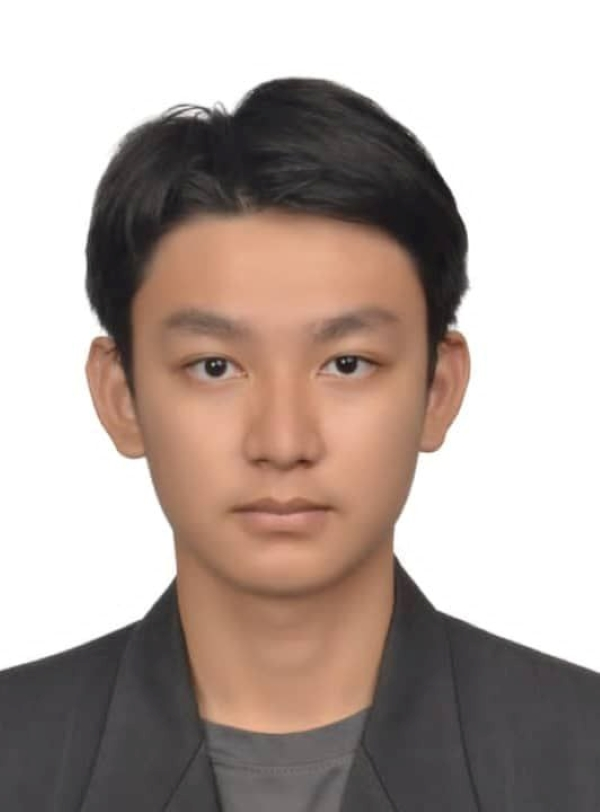

# About Us

We are a team based in the [School of Computing, National University of Singapore](http://www.comp.nus.edu.sg).

You can reach us at the email `seer[at]comp.nus.edu.sg`

## Project team

### Christopher Lu Zi Yang

[[homepage](http://www.comp.nus.edu.sg/~damithch)]
[[github](https://github.com/chrislzy2212)]
[[portfolio](team/johndoe.md)]

* Role: Developer
* Responsibilities : Testing

### Kim Siang

[[homepage](http://www.comp.nus.edu.sg/~damithch)]
[[github](https://github.com/kimsianglim)]
[[portfolio](team/johndoe.md)]

* Role: Developer
* Responsibilities : Testing

### Liew Yu Le

[[github](https://github.com/liewyule)]

* Role: Developer
* Responsibilities: UI

### Ming You

[[github](http://github.com/johndoe)]
[[portfolio](team/johndoe.md)]

* Role: Team Lead
* Responsibilities: UI

### Ethan Shum

[[github](http://github.com/ethan-shum)]

* Role: TP Member
* Responsibilities: Finish TP
